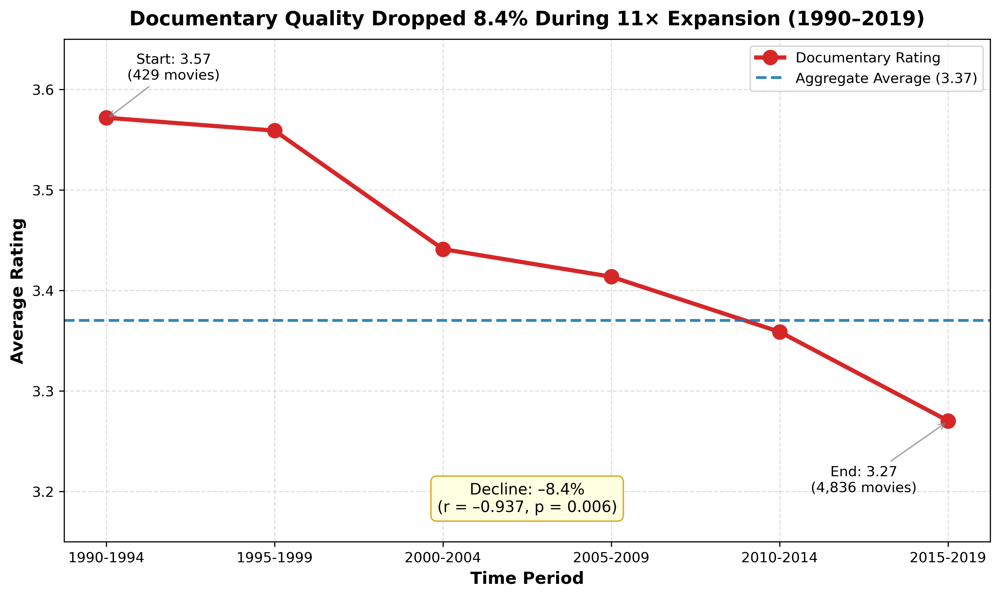

# Movie Quality & Engagement Analysis: Understanding Content Strategy Through Data

**Analyzing 226,000+ MUBI movies and 15.5 million user ratings to uncover the paradox between cross-sectional correlation and temporal trends**

[](https://www.python.org/)
[](https://pandas.pydata.org/)
[](LICENSE)

[View Full Analysis Notebook](https://github.com/ChisomChioke/MUBI-Movie-Analysis/blob/main/Movie_Data_Analysis.ipynb) | [View Project Summary](link-if-you-have-summary.pdf)

---

## 📊 Executive Summary

This project analyzes the relationship between content volume, quality, and user engagement using 
15.5 million MUBI user ratings across 226,000+ movie titles spanning 19 genres. The analysis reveals 
a critical methodological insight: **cross-sectional analysis can mask temporal degradation patterns**, 
leading to potentially flawed strategic decisions.

**Key Finding:** While cross-sectional data shows no relationship between production volume and quality 
(p = 0.47), temporal analysis reveals significant quality decline in certain genres during scaling periods. 
Documentary quality declined 8.4% (3.57 → 3.27, p = 0.006, r = -0.937) during an 11x volume expansion 
from 1990-2019.

---

## 🎯 Business Problem

**Context:** Content platforms must balance quantity (catalog breadth) with quality (user satisfaction). 
Understanding whether scaling production compromises quality is critical for strategic planning.

**Research Questions:**
1. Does increased production volume correlate with quality degradation?
2. Are these relationships consistent across genres, or genre-specific?
3. Do cross-sectional snapshots accurately reflect temporal trends?

**Stakeholders:** Content strategy teams, platform executives, production planners

---

## 📁 Dataset

**Sources:**
- **MUBI Dataset:** 226,575 movies with user ratings, genres, release years
- **TMDB Dataset:** 1.3 million movies with metadata for enrichment

**Scale:**
- 15.5 million user ratings analyzed
- 226,575 unique movie titles
- 19 genre categories
- Time span: 1900s-2020s

**Data Quality Challenges:**
- 61.45% match rate between MUBI and TMDB (fuzzy matching on title + release year)
- 52% of movies classified as multi-genre (handled via weighted attribution)
- Rating distributions: High (65,910), Medium (42,894), Low (33,860)

---

## 🔍 Methodology

### **1. Data Integration**
```python
# Fuzzy matching to merge MUBI and TMDB datasets
from fuzzywuzzy import fuzz

# Achieved 61.45% match rate using title + release year
# Handled multi-genre films (52% of dataset) through weighted attribution
```

### **2. Feature Engineering**
- **Quality Metrics:** Average ratings (1-5 scale), rating distributions
- **Volume Metrics:** Movie counts by genre, decade, time period
- **Engagement Metrics:** Number of ratings per movie (popularity proxy)
- **Temporal Features:** 6 time periods (5-year windows) for trend analysis

### **3. Statistical Analysis**

| Method | Purpose | Key Results |
|--------|---------|-------------|
| **Correlation Analysis** | Test volume-quality relationship | Cross-sectional: r = -0.07, p = 0.47 (no relationship) |
| **Regression Analysis** | Model quality vs volume | R² = 0.005 (volume explains <1% of quality variance) |
| **Temporal T-Tests** | Compare early vs late periods | Documentary: t = 3.83, p = 0.006 (significant decline) |
| **Trend Analysis** | Examine within-genre trajectories | Strong negative correlation in 4/19 genres |

### **4. Key Insight: Cross-Sectional vs Temporal Paradox**

**Cross-Sectional View (Misleading):**
- Looking at all movies at once: no volume-quality relationship (p = 0.47)
- Conclusion: "Scaling doesn't affect quality"

**Temporal View (Reveals Truth):**
- Looking at genres over time: significant quality decline during scaling
- Documentary: 85% of films produced 1990-2019 when quality dropped 8.4%
- Conclusion: "Aggregate metrics mask temporal degradation"

**Implication:** Strategic decisions based solely on cross-sectional data can be flawed.

---

## 📈 Key Findings

### **Finding 1: Genre-Specific Scaling Vulnerability**

**High Baseline Quality Genres Struggle Most:**

| Genre | Avg Rating | 1990-2019 Trend | Statistical Significance |
|-------|-----------|-----------------|-------------------------|
| **Documentary** | 3.37 | 3.57 → 3.27 (-8.4%) | p = 0.006, r = -0.937 ⭐ |
| **Romance** | 2.92 | Declining | p < 0.05 ⭐ |
| **Comedy** | 2.84 | Stable | p > 0.05 ✅ |
| **Thriller** | 3.06 | Stable | p > 0.05 ✅ |

**Visualization:**


*Documentary quality dropped 8.4% during 11x expansion (1990-2019)*

### **Finding 2: The Cross-Sectional Paradox**

**Why Aggregate Analysis Failed:**
1. 85% of Documentary films produced during declining period (1990-2019)
2. Cross-sectional average (3.37) represents mostly low-quality period
3. Earlier high-quality period (3.57) underweighted due to lower volume
4. Result: Aggregate hides the decline that temporal analysis reveals

### **Finding 3: Genre Dominance in Dataset**

| Genre | Movie Count | Avg Rating | Popularity |
|-------|------------|------------|------------|
| Drama | 45,765 (20.2%) | 3.05 | High |
| Comedy | 24,018 (10.6%) | 2.84 | High |
| Documentary | 14,509 (6.4%) | 3.37 | Medium |
| Thriller | 13,682 (6.0%) | 3.06 | High |

---

## 💡 Strategic Recommendations

### **For Content Platforms:**

**1. Genre-Specific Scaling Strategies**
- **Constrain expansion:** Documentary and Romance (vulnerable to quality loss)
- **Scale aggressively:** Comedy and Thriller (maintain quality during growth)

**2. Quality Monitoring Framework**
- Implement temporal tracking (not just cross-sectional snapshots)
- Monitor within-genre trends during scaling periods
- Early warning system: quality decline → pause expansion

**3. Resource Allocation**
- High-baseline genres need premium curation during scaling
- Lower-baseline genres can absorb volume better

**4. Methodological Lesson**
- Always combine cross-sectional AND temporal analysis
- Don't rely solely on aggregate metrics
- Simpson's Paradox awareness in strategic planning

---

## 🛠️ Technical Stack

**Languages & Libraries:**
- **Python 3.8+**
- **Data Manipulation:** Pandas, NumPy
- **Statistical Analysis:** SciPy, Statsmodels
- **Visualization:** Matplotlib, Seaborn
- **Text Matching:** FuzzyWuzzy

**Tools:**
- Jupyter Notebook
- Git/GitHub for version control

---

## 📂 Repository Structure
```
mubi-movie-analysis/
│
├── data/
│   ├── raw/                    # Original datasets (not tracked due to size)
│   └── processed/              # Cleaned, merged datasets
│
├── notebooks/
│   ├── 01_data_cleaning.ipynb
│   ├── 02_eda.ipynb
│   ├── 03_statistical_analysis.ipynb
│   └── 04_visualizations.ipynb
│
├── images/                     # Charts and visualizations
│   ├── documentary_decline.png
│   ├── genre_distribution.png
│   └── cross_sectional_vs_temporal.png
│
├── src/                        # Python modules (if applicable)
│   ├── data_processing.py
│   └── statistical_tests.py
│
├── README.md                   # This file
├── requirements.txt            # Python dependencies
└── LICENSE
```

---

## 🚀 Getting Started

### **Prerequisites**
```bash
Python 3.8+
pip or conda
```

### **Installation**
```bash
# Clone the repository
git clone https://github.com/yourusername/mubi-movie-analysis.git
cd mubi-movie-analysis

# Install dependencies
pip install -r requirements.txt

# Launch Jupyter Notebook
jupyter notebook
```

### **Running the Analysis**
```bash
# Run notebooks in order:
1. notebooks/01_data_cleaning.ipynb
2. notebooks/02_eda.ipynb
3. notebooks/03_statistical_analysis.ipynb
4. notebooks/04_visualizations.ipynb
```

---

## 📊 Sample Visualizations

### **Documentary Quality Decline**


### **Cross-Sectional vs Temporal Analysis**


### **Genre Distribution**


---

## 🔬 Limitations & Future Work

### **Current Limitations:**
1. **Data coverage:** MUBI platform bias (art-house/independent films overrepresented)
2. **Match rate:** 61% MUBI-TMDB match leaves 39% without enriched metadata
3. **Multi-genre:** 52% of films span multiple genres (weighted attribution approach)
4. **Causation:** Correlation analysis cannot prove causal relationships
5. **Selection bias:** User ratings may not represent general population preferences

### **Future Enhancements:**
1. **Expand data sources:** Include IMDb, Rotten Tomatoes for validation
2. **Causal inference:** Apply methods to establish causation (instrumental variables, RDD)
3. **Predictive modeling:** Build ML models to forecast quality during scaling
4. **Real-time monitoring:** Dashboard for ongoing quality tracking
5. **Sentiment analysis:** Incorporate review text for deeper quality assessment

---

## 👤 Author

**Chisom Chioke**
- 📧 Email: cs.chioke@gmail.com
- 💼 LinkedIn: [linkedin.com/in/yourprofile](https://linkedin.com/in/yourprofile)
- 🌐 Portfolio: [yourportfolio.com](https://yourportfolio.com)
- 📊 Tableau: [Tableau Public Profile](https://public.tableau.com/yourprofile)

---

## 📄 License

This project is licensed under the MIT License - see the [LICENSE](LICENSE) file for details.

---

## 🙏 Acknowledgments

- MUBI for providing the movie rating dataset
- TMDB for movie metadata
- Open-source community for Python data science tools

---

## 📚 References

1. MUBI Dataset: [Source link if public]
2. TMDB API: https://www.themoviedb.org/documentation/api
3. Statistical Methods: [Relevant papers or textbooks if cited]

---

**⭐ If you found this analysis useful, please consider starring the repository!**
```

---

## 📋 **Quick Action Checklist:**

### **To Complete Your GitHub:**

- [ ] **Create `README.md`** (copy the content above)
- [ ] **Add `.gitignore`** for Python:
```
# Python
__pycache__/
*.py[cod]
*$py.class
*.so
.Python
env/
venv/
*.ipynb_checkpoints

# Data (if large)
data/raw/
*.csv
*.zip

# OS
.DS_Store
Thumbs.db
```

- [ ] **Create `requirements.txt`**:
```
pandas==1.3.5
numpy==1.21.5
scipy==1.7.3
statsmodels==0.13.2
matplotlib==3.5.1
seaborn==0.11.2
fuzzywuzzy==0.18.0
python-Levenshtein==0.12.2
jupyter==1.0.0
```

- [ ] **Create `/images` folder** with your key charts
- [ ] **Save your main notebook** as `analysis.ipynb` in root or `/notebooks`
- [ ] **Add LICENSE file** (MIT recommended):
```
MIT License

Copyright (c) 2025 Chisom Chioke

Permission is hereby granted, free of charge, to any person obtaining a copy...
[standard MIT license text]
