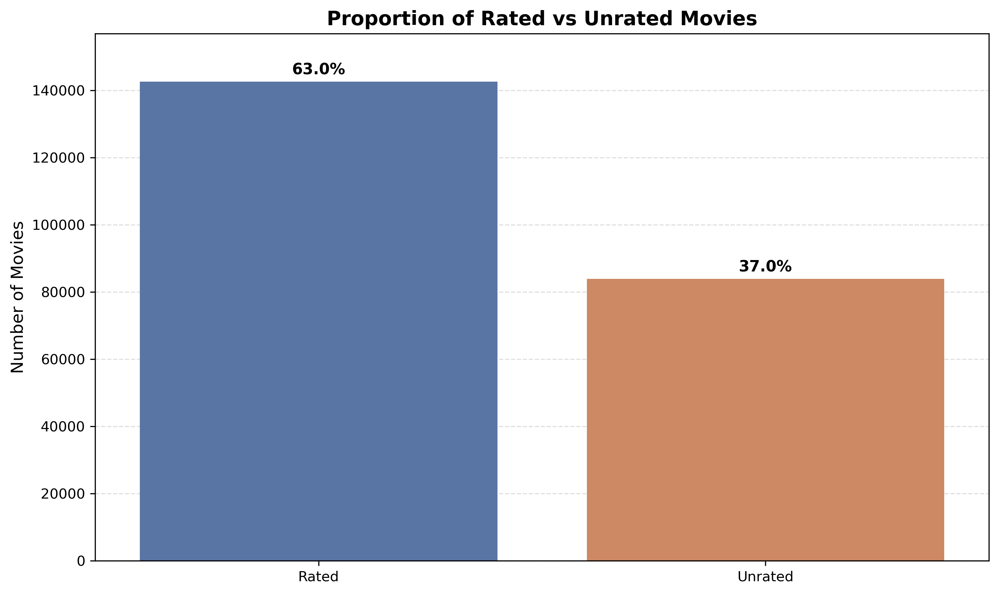
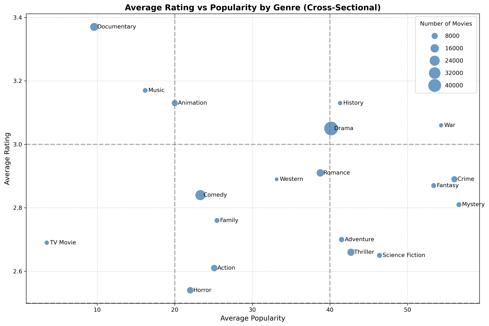
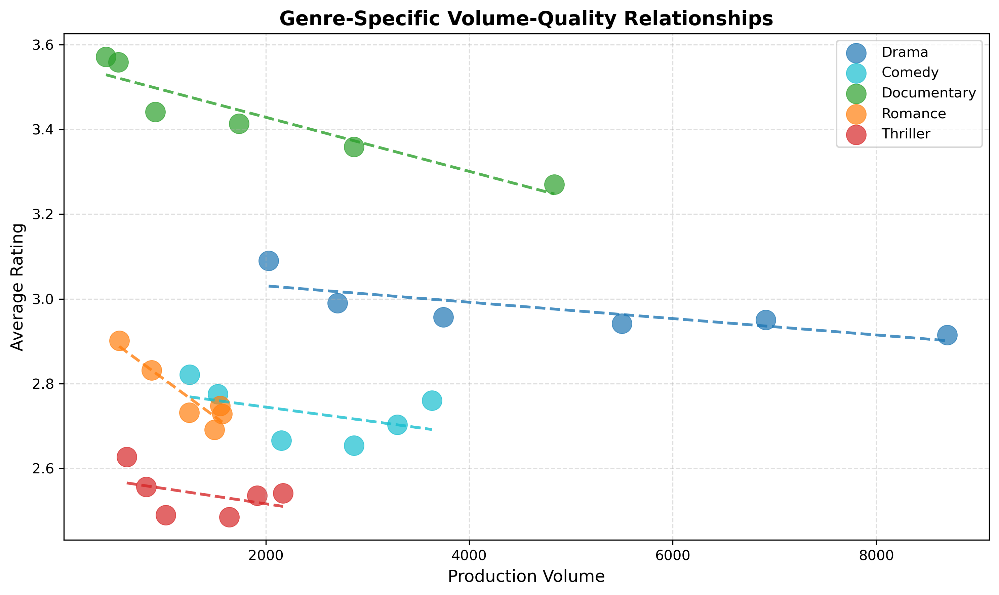
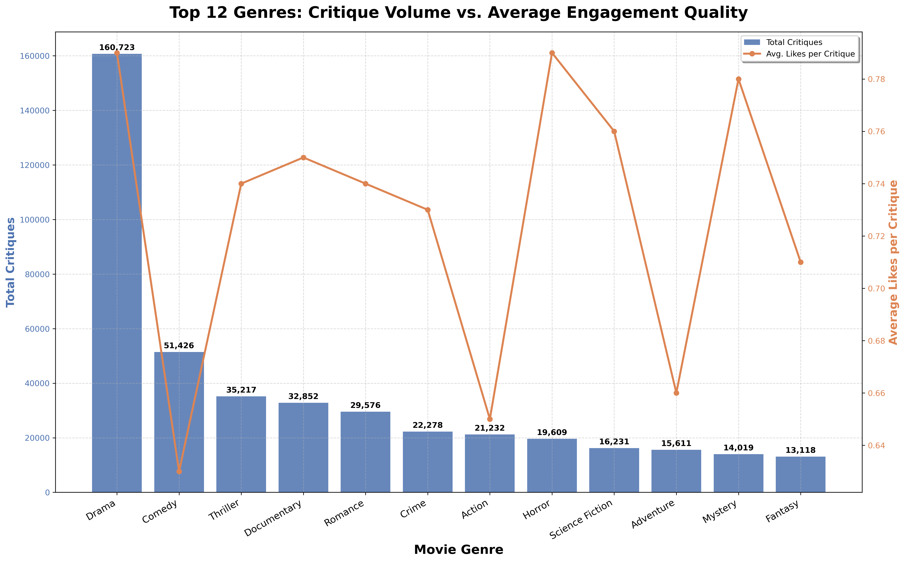
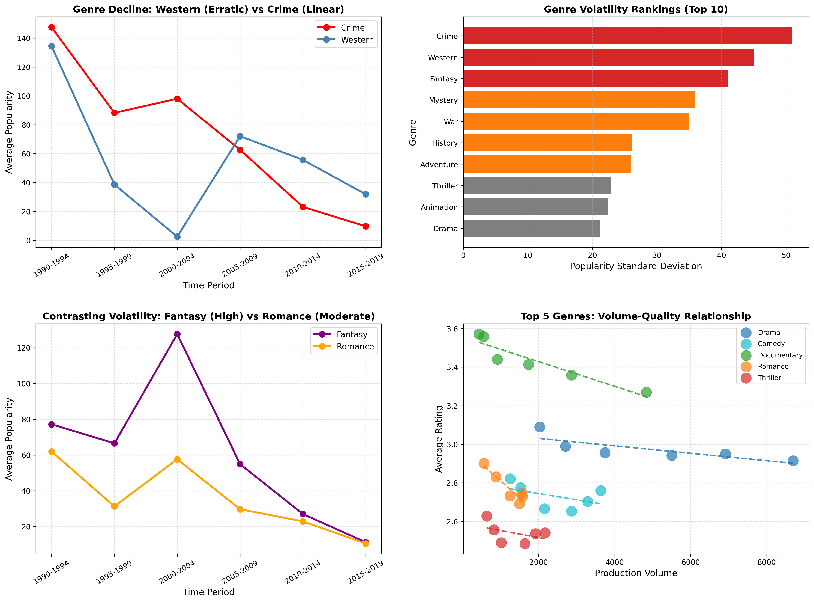

# Genre Scaling Risk in Streaming Content: A Statistical Analysis of Production Volume vs Quality in MUBI Movies

#### A MUBI case study showing that aggregate genre metrics can hide quality decline during expansion, making genre-specific scaling strategy more effective than one-size-fits-all volume growth.

## Table of Contents
- [Project Overview](#project-overview)
- [Business Problem](#business-problem)
- [Data Overview](#data-overview)
- [Methodology](#methodology)
- [Key Findings](#key-findings)
- [Strategic Recommendations](#strategic-recommendations)
- [Key Takeaways](#key-takeaways)
- [Limitations & Future Work](#limitations--future-work)
- [Technologies Used](#technologies-used)

## Project Overview

Streaming platforms face a critical question: **does scaling content production compromise quality?** Using **226,575 movies** across 19 genres spanning 1878-2021, I built a statistical framework analyzing 1990-2019 trends, revealing that **aggregate metrics mask quality degradation during rapid expansion**—Documentary's 3.37 overall rating hides an **8.4% decline** during 11x volume growth.

**Full Analysis Notebook:** [Link to Jupyter Notebook](https://github.com/ChisomChioke/MUBI-Movie-Analysis/blob/main/Movie_Data_Analysis.ipynb)

**One-Page Summary:** [View Project Summary](https://drive.google.com/file/d/14hrJJUFomB6r9yixJ32uZ06Z9TU_9A4M/view)

## Business Problem
Content platforms rely on aggregate ratings to guide expansion decisions, but **cross-sectional metrics mask temporal quality erosion.** Documentary appeared high-performing (3.37 rating) while actively declining from 3.57 to 3.27 during 11x expansion—potentially triggering misguided investment that accelerates brand dilution.

**Critical Questions:**
1. Does production volume systematically predict content quality?
2. Which genres can scale safely vs. those requiring strict curation?
3. How should platforms allocate resources across genres with different scaling dynamics?

Traditional cross-sectional analysis would recommend expanding Documentary based on its strong 3.37 aggregate rating. However, **85% of Documentary films were produced during 1990-2019,** when quality declined significantly (r = -0.937, p = 0.006). Aggregate metrics mislead strategy when they mask temporal trajectories.

## Data Overview

**Primary Dataset:** [MUBI SVOD Platform Database](https://www.kaggle.com/datasets/clementmsika/mubi-sqlite-database-for-movie-lovers)

**Supplementary Data:** [TMDB Movie Dataset](https://www.kaggle.com/datasets/asaniczka/tmdb-movies-dataset-2023-930k-movies) (genre enrichment)

- **Raw data:** 226,575 movies | 15.5M user ratings
- **After genre enrichment:** 139,237 movies with genre data (61% match rate)
- **Temporal scope:** 1990-2019 analysis (2020-2024 excluded due to 95% data discontinuity)
- **Genres analyzed:** 19 genres including Drama, Comedy, Documentary, Horror, Thriller

#### Key Variables:
- **Rating:** 1-5 scale user ratings (aggregate: mean 3.37)
- **Popularity:** Number of users who "love" the movie
- **Volume:** Movie count per genre per time period
- **Engagement:** Average likes per user critique

#### Data Preparation:
- Fuzzy matching merged MUBI ratings with TMDB genres (61% match rate)
- Multi-genre attribution: 52% of films assigned to multiple genres (weighted analysis)
- Temporal binning: 6 five-year periods (1990-2019) for trend analysis
- 2020-2024 excluded: 95% volume collapse indicates incomplete data

_Figure 1: 63% of movies have user ratings, while 37% remain unrated—indicating potential discoverability gaps and opportunities for targeted promotion._

## Methodology
This project combines three layers of analysis:

**1. Cross-sectional benchmarking** to compare genres at aggregate whether higher-volume genres have lower ratings overall

**2. Temporal trend analysis** to examine whether quality declines within genres as they scale over time

**3. Engagement analysis** to test whether critique quality is driven by genre volume or by genre-specific audience behavior

This approach reveals patterns invisible in static snapshots: genres may maintain stable cross-sectional rankings while simultaneously experiencing quality decline during expansion.

**Methods used:** Pearson/Spearman correlation, OLS regression, Welch’s t-tests, and volatility analysis across six five-year periods (1990–2019).

## Key Findings

**Finding #1: Cross-Sectional Analysis Misleads Strategy**

_Figure 2: Cross-sectional view suggests Documentary (3.37 rating, 14,509 films) is a safe expansion target. However, this aggregate metric masks an 8.4% quality decline during 11x growth (1990-2019)._

**Cross-sectional correlation:** r = 0.175, p = 0.472 (not significant)
- No systematic volume-quality relationship detected
- High-rated genres span full volume spectrum
- Documentary (3.37, 14,509 films) vs. Music (3.17, 3,842 films)

**Critical limitation:** Aggregate ratings combine stable early period (3.57, 429 movies, 1990-1994) with degraded recent period (3.27, 4,836 movies, 2015-2019), masking temporal erosion.

**Strategic implication:** Relying on cross-sectional metrics alone would trigger Documentary expansion during active quality decline.

---

**Finding #2: Temporal Scaling Risks Are Genre-Specific**

_Figure 3: Documentary quality dropped 8.4% during 11x expansion (1990-2019): 3.57 (429 movies) → 3.27 (4,836 movies). Strong negative correlation (r = -0.937, p = 0.006) confirms quality degradation accompanies scaling._

#### Within-Genre Volume-Quality Correlations (1990-2019):

| Genre | Volume Growth | Quality Change | Correlation | p-value | Pattern |
|--------|---------|-------------|---------|----------|----------|
| **Documentary** | 11x (429→4,836) | -8.4% (3.57→3.27) | r=-0.937 | **0.006** | ✗ Constrain + curate |
| **Romance** | 3x (559→1,572) | -7.2% (2.90→2.69) | r=-0.934 | **0.006** | ✗ Constrain + curate |
| **Comedy** | 3x (1,024→3,646) | Stable | r=-0.471 | 0.345 | ✓ Scale confidently |
| **Thriller** | 3x (1,087→3,228) | Stable | r=-0.438 | 0.385 | ✓ Scale confidently |
| **Crime** | Expansion | Linear decline | p=0.002 | **0.002** | Prestige projects only |

_Figure 4: Genre-specific scaling patterns reveal differentiated risks: Documentary and Romance show statistically significant quality degradation (r ≈ -0.93, p = 0.006), while Comedy and Thriller maintain quality despite similar growth rates._

**Key insight:** High-baseline-quality genres (Documentary: 3.57 → 3.27) face greater scaling vulnerability than moderate-quality genres (Comedy: stable ~2.7-2.8). Quality erosion is not universal—it depends on genre-specific curation capacity and audience expectations.

---

**Finding #3: Engagement is Genre-Specific, Not Metric-Driven**

_Figure 5: Drama achieves both high volume (160,723 critiques) and high engagement (0.79 avg likes). Comedy shows high volume (51,426) but lowest engagement (0.63), while Horror maintains high engagement with low volume—demonstrating engagement is genre-specific, not scale-driven._

#### Engagement Analysis Results:

| Test | Variables | Result | p-value | Interpretation |
|-------|-----------|-----------------|-------------|------------|
| Volume-Engagement | Critique volume vs. avg likes | r = 0.312 | 0.193 | No systematic relationship |
| High vs. Low Volume | Bottom 25% vs. Top 25% | Δ = 0.072 | 0.297 | No significant difference | 
| Rating-Engagement | Genre rating vs. avg likes | r = 0.121 | 0.621 | Quality ≠ engagement |

#### Key patterns:
- **Drama:** High volume + high engagement (0.79) = successful scaling
- **Comedy:** High volume + low engagement (0.63) = content-audience misalignment
- **Horror/Mystery:** Low volume + high engagement = passionate niche communities

**Strategic insight:** Engagement quality reflects **genre identity and community culture**, not production volume or aggregate ratings. Drama proves scale and quality can coexist; Comedy's anomaly requires investigation.

---

**Finding #4: Genre Volatility Reveals Strategic Risks**

_Figure 6: Four-panel analysis reveals: Crime shows linear decline (top-left), volatility hierarchy confirms Crime/Western/Fantasy as most unstable (top-right), Fantasy exhibits boom-bust cycles vs. Romance's moderate fluctuations (bottom-left), and volume-quality correlations differ by genre (bottom-right)._

#### Genre Volatility Rankings (Popularity Standard Deviation):

1. **Crime** (SD = 50.96): Linear decline from 148 → 15 (p = 0.002)
2. **Western** (SD = 45.04): Erratic fluctuations (134→3→72→32)
3. **Fantasy** (SD = 41.00): Boom-bust spike (128 in 2000-2004 → crash)

#### Strategic implications:
- **Crime:** Sustained decline requires prestige-project strategy
- **Western:** Erratic volatility suggests event-driven, cyclical investment
- **Fantasy:** Boom-bust cycles require market timing awareness

---

## Strategic Recommendations
Based on statistical findings, implement **differentiated genre strategies:**

#### 1. Constrain Expansion with Strict Curation

**Genres:** Documentary, Romance

**Rationale:** Both show statistically significant quality degradation (r ≈ -0.93, p = 0.006) during scaling

**Actions:**
- Slow expansion in Documentary and Romance until quality trends stabilize
- Introduce stricter greenlighting and curation thresholds for genres showing measurable scaling risk
- Shift resources to prestige curation over volume growth

**Expected Impact:** Prevent further quality erosion; stabilize brand reputation

---

#### 2. Scale Confidently

**Genres:** Comedy, Thriller
**Rationale:** Both maintained quality despite 3x volume growth (p > 0.3)

**Actions:**
- Continue current expansion trajectory
- Monitor engagement quality (Comedy shows warning signals at 0.63 avg likes)
- Allocate growth capital to proven scalable genres

**Expected Impact:** Maximize catalog growth without quality risk

---

#### 3. Investigate Comedy Engagement Gap

**Problem:** Comedy shows high volume (51,426 critiques) but lowest engagement (0.63 avg likes vs. 0.79 for Drama/Horror)

**Actions:**
- Conduct qualitative research on audience expectations
- Test content tone variations (dark comedy vs. slapstick vs. satire)
- Analyze critique sentiment to identify misalignment sources

**Expected Impact:** Close 20% engagement gap with Drama benchmark

---

#### 4. Leverage Niche Communities

**Genres:** Horror, Mystery (high engagement, low volume)

**Actions:**
- Invest strategically in 10-15 high-quality titles per year
- Build community features (genre-specific forums, exclusive previews)
- Use engagement metrics (0.78-0.79 avg likes) to guide curation

**Expected Impact:** Maximize engagement efficiency; strengthen loyal communities

---

#### 5. Manage Declining Genres Strategically

**Crime (linear decline, p = 0.002):**
- Shift to prestige projects (2-3 high-budget films/year)
- Avoid volume-based strategies

**Western (erratic volatility):**
- Treat as cyclical, event-driven content
- Monitor for revival signals before investment

**Expected Impact:** Minimize capital allocation to structurally declining genres

---

#### 6. Implement Temporal Quality Monitoring

**System Requirements:**
- Track within-genre quality trends quarterly (not just aggregate metrics)
- Alert when moving average drops >0.1 points over 2 periods
- Trigger curation reviews before degradation becomes entrenched

**Expected Impact:** Early detection prevents Documentary-style hidden erosion

---

## Key Takeaways
This project demonstrates:

1. **Cross-sectional analysis alone is insufficient** — Documentary's 3.37 aggregate rating masks 8.4% temporal decline, illustrating how static metrics mislead expansion decisions
2. **Genre-specific strategies are essential** — No universal scaling rules exist. Documentary degrades during expansion (r = -0.937), Comedy maintains quality (r = -0.471), requiring differentiated approaches
3. **Temporal monitoring prevents hidden erosion** — Early detection systems can trigger curation reviews before degradation becomes entrenched, as evidenced by Documentary's undetected decline
4. **Engagement reflects community, not metrics** — Drama's high engagement (0.79) despite high volume, and Comedy's low engagement (0.63) despite similar volume, prove engagement is genre-specific
5. **Statistical rigor reveals counterintuitive insights** — Visual patterns suggesting Western decline proved statistically insignificant (p = 0.353), while Crime's decline reached high significance (p = 0.002)

The framework successfully shifts content strategy from **volume-driven** to **genre-specific, quality-weighted** approaches—helping platforms make more targeted expansion decisions while reducing the risk of hidden quality erosion.

## Limitations & Future Work

### Current Limitations
1. **Statistical power:** Only 6 five-year periods limit ability to detect moderate effects
2. **Data completeness:** 2020-2024 excluded due to 95% volume collapse; recent trends unknown
3. **Match rate:** 61% genre match rate may introduce selection bias toward well-documented films
4. **Multi-genre complexity:** 52% of films belong to multiple genres; weighted attribution may not fully capture dynamics
5. **Causation:** Correlations don't establish causal mechanisms (e.g., curation capacity vs. talent dilution vs. audience saturation)

### Future Research
**1. Causal Mechanisms**
- Investigate what drives genre-specific quality degradation during scaling
- Test hypotheses: curation capacity limits, talent pool dilution, audience saturation
- Conduct natural experiments comparing platforms with different scaling approaches

**2. Movie-Level Analysis**
- Analyze individual film trajectories within genres to identify outliers
- Build predictive models: Which films beat/underperform genre trends?

**3. Content Characteristics**
- Test whether runtime, budget, or cast composition mediate volume-quality relationships
- Examine whether prestige directors/actors buffer against scaling degradation

**4. Comedy Deep Dive**
- Conduct qualitative research on Comedy's anomalous low engagement (0.63 vs. 0.79)
- Test content variations to identify audience expectation gaps

**5. Platform Generalization**
- Replicate analysis across Netflix, Amazon Prime, Disney+
- Test whether findings generalize across rating systems (IMDb, Rotten Tomatoes)

**6. Audience Segmentation**
- Examine whether engagement patterns differ by user demographics or viewing history
- Identify which user segments drive genre-specific community culture

## Technologies Used
- **Python** — Data analysis and statistical modeling
    - **Pandas/NumPy** — Data manipulation and aggregation
    - **SciPy/Statsmodels** — Statistical testing (correlation, regression, t-tests)
    - **Matplotlib/Seaborn** — Visualization and trend analysis

- **SQL** — Data extraction and transformation
- **Jupyter Notebook** — End-to-end reproducible analysis
- **Fuzzy Matching** — Genre enrichment (MUBI + TMDB integration)
